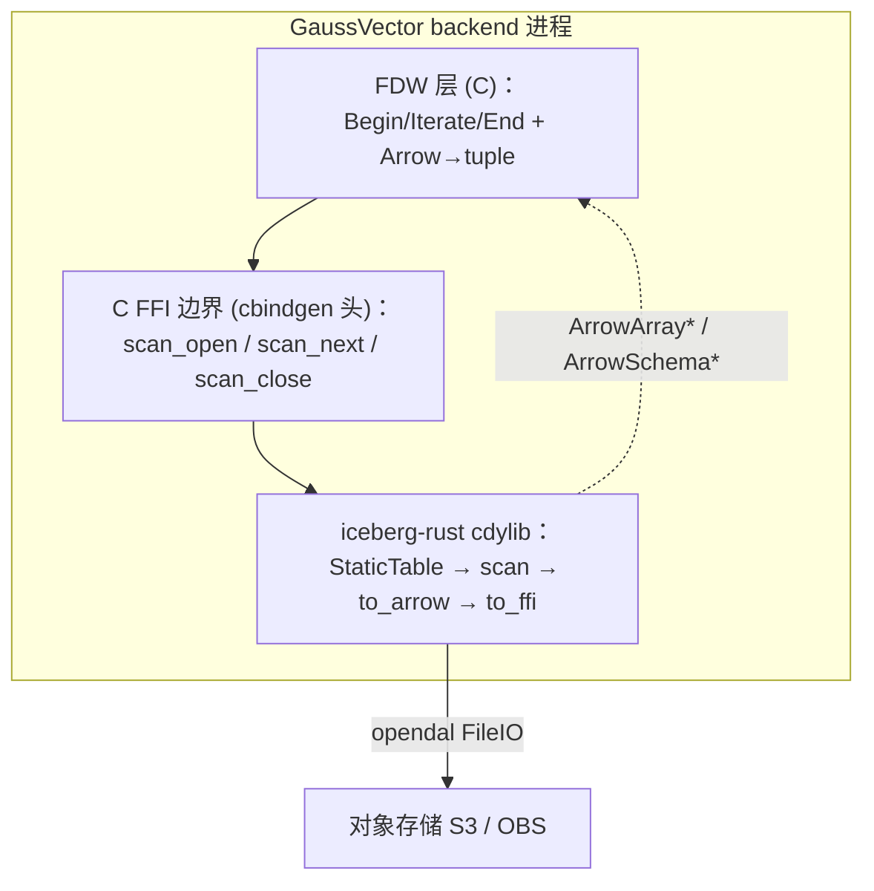

# GaussVector — Iceberg Reader 详细设计：iceberg-rust + C FFI

## 1. 设计背景

### 1.1 设计目标与范围

实现 Iceberg 外表只读扫描的 reader 下半层：以 iceberg-rust 解析元数据、规划并读取数据文件，经 Arrow C Data Interface 把列式批交给 FDW 层。reader 编为 C-ABI 共享库，以插件形式挂载到 GaussVector，运行期为原生进程，不引入虚拟机。

| 项目 | 范围 |
| --- | --- |
| 形态 | iceberg-rust 编为 `cdylib` / `staticlib`，自建 C FFI（cbindgen 生成头） |
| 落地 | 以插件挂载闭源 GaussVector，openGauss 为受体参考 |
| 输出 | Arrow C Data Interface（`ArrowArray*` / `ArrowSchema*`） |
| 表加载 | `metadata_location` 直读，经 `StaticTable` 加载只读表，无 catalog 依赖 |
| 能力 | 列裁剪、简单谓词下推、position + equality delete（MOR） |
| 存储 | S3 / OBS（opendal FileIO） |
| 上层契约 | 复用 FDW 层（[5.md](./5.%20Iceberg_FDW%20%E8%AF%A6%E7%BB%86%E8%AE%BE%E8%AE%A1.md)）的 reader 接口，签名不变 |

### 1.2 整体架构

reader 是 FDW 层之下的取数后端。FDW 层经 C FFI 调用 reader，reader 内部完成 `metadata.json → manifest → data file(+delete)` 全链路解析与读取，把每个 Arrow 批回传 FDW 层转 tuple。



### 1.3 接口契约

reader 对 FDW 层暴露三个 C 接口，签名沿用 [6.md](./6.%20fdw-iceberg-sdk-arrow-design.md) §3.2.3：

```c
IcebergScan *iceberg_scan_open(MemoryContext cxt,
                               const char *metadata_path,
                               const char *storage_config,
                               const char **columns, int n_columns,
                               const char *filter,
                               ArrowSchema **out_schema);
int  iceberg_scan_next (IcebergScan *scan, ArrowArray **out_array, ArrowSchema **out_schema);
void iceberg_scan_close(IcebergScan *scan);
```

输入是 `metadata_location` + 存储凭证 + 投影列 + 下推 filter，输出是 Arrow C Data Interface。该契约与 reader 实现语言独立，FDW 层（5.md 的 `BeginForeignScan` / `IterateForeignScan` / `ArrowBatchToHeapTuples`）保持原样。

---

## 2. 数据结构

### 2.1 crate 组织

自建薄封装 crate `gv_iceberg_reader`，封装 iceberg 核心 crate 的扫描能力并经 C FFI 导出。

```toml
# gv_iceberg_reader/Cargo.toml（示意）
[lib]
crate-type = ["cdylib", "staticlib"]   # cdylib 供 dlopen；staticlib 供编译期静态链接

[dependencies]
iceberg = "0.9"                          # StaticTable / TableScan / to_arrow
arrow   = "<与 iceberg 对齐版本>"          # to_ffi → FFI_ArrowArray / FFI_ArrowSchema
tokio   = { version = "1", features = ["rt"] }   # current-thread 运行时

[build-dependencies]
cbindgen = "0.26"
```

### 2.2 扫描句柄（Rust 侧）

每次扫描分配一个句柄，持有运行时、Arrow 流与列结构，按 scan 隔离：

```rust
pub struct GvIcebergScan {
    rt:      tokio::runtime::Runtime,        // current-thread 运行时
    stream:  ArrowRecordBatchStream,         // scan.to_arrow() 的异步批流
    schema:  SchemaRef,                       // 输出列结构，open 时回填给 FDW
}
```

`IcebergScan`（C 侧 opaque handle）即指向 `GvIcebergScan`。

### 2.3 C FFI 导出

cbindgen 据 Rust `extern "C"` 函数生成头文件。导出函数与 §1.3 契约对应，附错误出参：

```c
typedef struct GvIcebergScan GvIcebergScan;

GvIcebergScan *gv_iceberg_scan_open(const char *metadata_path,
                                    const char *storage_config_json,
                                    const char *const *columns, int n_columns,
                                    const char *filter_json,        /* 可空 */
                                    struct ArrowSchema *out_schema,
                                    char *errbuf, int errbuf_len);
int  gv_iceberg_scan_next (GvIcebergScan *scan,
                           struct ArrowArray  *out_array,
                           struct ArrowSchema *out_schema,
                           char *errbuf, int errbuf_len);   /* 返回 nrows，0=EOF，<0=错误 */
void gv_iceberg_scan_close(GvIcebergScan *scan);
```

FDW 层经一层内联 C 包装把 `iceberg_scan_open(...)` 映射到 `gv_iceberg_scan_open(...)`，`MemoryContext` 与凭证组装在 C 侧完成。

---

## 3. 读取详细设计

### 3.1 表加载

`StaticTable::from_metadata_file` 从 `metadata_location` 与 `FileIO` 加载只读表，`into_table()` 得到可扫描的 `Table`，对应 Iceberg `loadTable` 的只读部分。

```rust
let file_io = FileIOBuilder::new("s3")
    .with_prop("s3.endpoint",  endpoint)
    .with_prop("s3.region",    region)
    .with_prop("s3.access-key-id",     ak)
    .with_prop("s3.secret-access-key", sk)
    .with_prop("s3.path-style-access", "true")   // MinIO / OBS 兼容
    .build()?;

let table = StaticTable::from_metadata_file(metadata_location, table_ident, file_io)
    .await?
    .into_table();
```

### 3.2 扫描构建

`select` 做列裁剪（列下推），`with_filter` 接收 C 侧 filter 解析出的 `Predicate`（行下推），`to_arrow` 产出 Arrow `RecordBatch` 异步流。

```rust
let scan = table.scan()
    .select(columns)
    .with_filter(predicate)          // filter 为空时省略
    .build()?;
let stream: ArrowRecordBatchStream = scan.to_arrow().await?;
```

filter 协议沿用 6.md §4.3：AND 合取的 `col OP const`（`= <> < <= > >=`）、`col IS [NOT] NULL`、`col IN (const…)`，列名引用、字面量带类型；C 侧把 filter 串映射为 iceberg-rust `Predicate`（`Reference::new(col).less_than(Datum)` 等）。

### 3.3 异步到同步桥接

GaussVector backend 为同步单线程模型。句柄持有 current-thread 运行时，`scan_next` 时 `block_on` 拉取一个批：

```rust
let batch: Option<RecordBatch> = scan.rt.block_on(scan.stream.next());
```

current-thread 运行时把扫描 I/O 限定在当前线程，与 backend 的信号与内存模型对齐。

### 3.4 Arrow 导出

arrow crate 内置 Arrow C Data Interface 绑定。每个 `RecordBatch` 经 `StructArray` 调 `to_ffi` 得到 `FFI_ArrowArray` / `FFI_ArrowSchema`，与 `ArrowArray*` / `ArrowSchema*` 二进制一致，C 侧据 `ArrowSchema.format` 建转换函数表后逐列读 buffer。逐批导出与 §1.3 的 `open / next / close` 时序一一对应。

### 3.5 错误处理

每个 `extern "C"` 函数以 `catch_unwind` 收敛 panic，iceberg-rust 与 opendal 的 `Result` 错误转为 `errbuf` 文本与负返回码；C 侧据返回码 `ereport(ERROR)`，纳入事务回滚。

### 3.6 内存所有权

Arrow buffer 由 Rust 分配，`FFI_ArrowArray` 持有 `release` 回调。C 侧把批转 tuple：定长类型直接读 buffer 值，变长（string / binary）与 decimal 经 `palloc` 拷入 `batch_cxt`；本批转换完成后调 `out_array->release(out_array)` 移交回收。Rust 分配的内存仅经 `release` 回调回收，PG 内存仅由 `MemoryContext` 管理，两侧所有权经 Arrow C Data Interface 单向移交。

### 3.7 Delete File（MOR）

iceberg-rust 的 `ArrowReader` 在扫描时读取并应用 position 与 equality delete，对调用方透明，输出已应用 delete 的 Arrow 批。本设计默认启用 MOR，无独立快/慢路径分支。

---

## 4. 上下游边界

### 4.1 上游：元信息表依赖

reader 消费一项元信息：`tables.metadata_location`，可选取 `tables.current_snapshot_id` / `current_schema_id` 用于定位与校验。元信息表结构遵循 [`gv_catalog_metadata_schema_design.md`](../../../new-catalog/design/gv_catalog_metadata_schema_design.md)。snapshot → manifest list → manifest → data file + delete file 的解析在运行期由 iceberg-rust 完成，schema evolution 基于 `field_id` 投影，由 SDK 内部处理。

| 数据 | 来源 | 取用方 |
| --- | --- | --- |
| `metadata_location` | `tables` 普通列 | reader 表加载入口 |
| `current_snapshot_id` | `tables` 普通列 | 定位扫描 snapshot（可选） |
| `current_schema_id` | `tables` 普通列 | schema 上下文校验（可选） |
| manifest / data / delete 明细 | 对象存储 | reader 运行期解析 |

### 4.2 下游：对象存储 FileIO

reader 经 opendal FileIO 访问 S3 / OBS。`storage_config` 由 server / user-mapping OPTIONS 组装为 JSON，含 endpoint、region、access-key、secret-key、path-style；OBS 经 S3 兼容模式接入。

### 4.3 与 FDW 层的边界

FDW 层经 §1.3 三接口驱动 reader，传入 `metadata_location` / `storage_config` / 投影列 / filter，收取 Arrow 批转 tuple。reader 对 FDW 层是 opaque 句柄；元数据解析、列裁剪、谓词下推、delete 应用在 reader 内完成。

---

## 5. openGauss / GaussVector 集成

### 5.1 FDW 接口兼容

核对 `src_ref/opengauss-server/src/include/foreign/fdwapi.h`：

| 事实 | 影响 |
| --- | --- |
| `FdwRoutine` 回调集与 PostgreSQL 同名同序 | 5.md 回调设计直接落到 openGauss |
| `GetForeignPlan` 含 `Plan *outer_plan` 第 7 参 | 5.md §3.3 已适配 |
| 存在向量化路径 `VecIterateForeignScan → VectorBatch*` | 见 §6 输出路径分析 |
| 扩展构建走 `MODULE_big` + `Makefile.global`，`exclude_option=-fPIE` | 链接 Rust 产物时校验 PIC |

reader 经 C ABI 与 Arrow C Data Interface 与内核交互，与内核版本解耦。

### 5.2 cdylib 挂载

| 方式 | 做法 | 评价 |
| --- | --- | --- |
| 运行时 dlopen | 扩展启动 `dlopen` 加载 `.so`，`dlsym` 取三符号 | 与内核构建解耦，最易插拔；同 pg_lake `resolve_sdk_symbols` 模式 |
| 编译期静态链接 | `staticlib` 经 `SHLIB_LINK` 链入扩展 `.so` | 单一产物，需统一工具链与符号可见性 |

两者均不改动内核源码；GaussVector 落地时按其扩展加载链替换胶水，依赖面收敛于稳定 C ABI。

### 5.3 运行时约束

| 项 | 约束 |
| --- | --- |
| panic | FFI 边界 `catch_unwind` 收敛，转返回码 + errbuf |
| 分配器 | Arrow buffer 经 `release` 回调移交；PG 内存由 `MemoryContext` 管理 |
| 线程 | current-thread 运行时 + `block_on`，扫描 I/O 限于当前线程 |
| PIC / glibc | cdylib 默认 PIC；在与内核一致的环境编译 Rust 产物 |
| 符号 | 仅导出 `#[no_mangle] extern "C"`，内部符号隐藏 |

---

## 6. 输出路径分析：行式与向量化

FDW 层有两条输出路径：行式 `IterateForeignScan → TupleTableSlot`，向量化 `VecIterateForeignScan → VectorBatch`。本章据 openGauss `VectorBatch` 结构判断二者取舍。

### 6.1 VectorBatch 与 Arrow 的结构差异

据 `src/include/vecexecutor/vectorbatch.h`，`VectorBatch` 按列持有 `ScalarVector`，批长 `BatchMaxSize = 1000`。`ScalarVector` 的值数组为 `ScalarValue m_vals[]`（`ScalarValue = uintptr_t`，每元素 8 字节 Datum），空值用逐行字节 `m_flag[]` 标记，变长类型经伴随缓冲 `m_buf` 存 PG varlena。

Arrow 与 VectorBatch 的列内存布局不同：

| 类型 | Arrow 列布局 | VectorBatch 列布局 |
| --- | --- | --- |
| int32 | 紧凑 4 字节数组 + 1-bit 位图 | 8 字节 Datum 数组 + 逐行字节标记 |
| bool | 1-bit 值位图 + 1-bit 空位图 | 8 字节 Datum + 逐行字节标记 |
| string | offset 数组 + 连续 data buffer | `m_buf` 内带头 varlena，`m_vals` 存指针 |
| decimal | decimal128（16 字节）紧凑数组 | `m_buf` 内 PG Numeric，`m_vals` 存指针 |

两者元素宽度、空值表达、变长与 decimal 表示均不同，无法对 buffer 做 memcpy 直转。Arrow → VectorBatch 与 Arrow → HeapTuple 一样按元素逐值转换。

### 6.2 行式与列式转换的难度与效益

逐值转换成本两条路径相同（均为 `O(rows × cols)`，变长与 decimal 均需拷贝），差异在装配开销、执行器适配与集成耦合：

| 维度 | Arrow → 行（HeapTuple） | Arrow → 列（VectorBatch） |
| --- | --- | --- |
| 装配开销 | 逐行 `heap_form_tuple` 构造带头元组 | 逐列填 `m_vals` / `m_flag`，无逐行元组头 |
| 执行器适配 | 上层为向量化计划时需经 Row→Vec 适配再进算子 | 直接喂向量化算子（`VecIterateForeignScan`） |
| 类型分发 | 逐行逐列分发 | 逐列分发，内层循环单一类型，分支更优 |
| 集成耦合 | 标准 Arrow→Datum，参考成熟（parquet_fdw、pg_lake） | 须按 GaussVector 向量化类型系统填 ScalarVector（`AddVar*` / `AddShortNumeric` / `m_flag` 语义），耦合内部向量化 ABI |

### 6.3 结论

首期走行式：契约稳定、集成面小、与开源 openGauss 对齐。向量化列式作为面向 GaussVector 向量化执行器的增强项（P2）：其收益在于省去逐行元组构造与 Row→Vec 重向量化，而非内存零拷贝；逐值转换不可省，且耦合内部向量化 ABI。reader 输出契约（Arrow C Data Interface）对两条路径一致，增强项不改变 reader 结构。

---

## 7. 实验计划

| 编号 | 目标 | 步骤 | 验证 |
| --- | --- | --- | --- |
| E1 | 端到端可读 | iceberg-rust 编 cdylib；实现三个 FFI 函数；C 侧复用 Arrow→HeapTuple；读 MinIO 上的表 | `SELECT *` 正确返回；进程内原生无虚拟机；含 delete file 的表正确读出 |
| E2 | 下推对齐 | `select` 列裁剪；filter 串 → `Predicate`（AND 合取标量比较） | 仅读投影列；带 `WHERE` 时文件/行剪枝，结果与全表过滤一致 |
| E3 | 资源/性能基线 | 测 RSS、首查询延迟、批吞吐 | 产出量化基线 |
| E4（P2） | 向量化输出 | Arrow → `VectorBatch`，走 `VecIterateForeignScan` | 向量化执行器消费，结果与行式一致 |

E1 为 gate：跑通即验证「只换 reader、不动 FDW 层与元信息表」的解耦假设。

E1 落地前经 PoC 核实的 ABI 点：`iceberg` 与 `arrow` crate 版本对齐（`to_arrow` 的 RecordBatch 与 FFI 类型同一 arrow 版本）；`StaticTable::from_metadata_file` 对目标表的加载路径。decimal 与嵌套类型（list / struct / map）的 `ArrowArray → Datum` 转换在 E1 内补齐。

---

## 附：外部依据

| 资源 | URL |
| --- | --- |
| iceberg-rust `StaticTable` | https://rust.iceberg.apache.org/api/iceberg/table/struct.StaticTable.html |
| iceberg-rust 0.9.0 Release | https://iceberg.apache.org/blog/apache-iceberg-rust-0.9.0-release/ |
| arrow-rs FFI（C Data Interface） | https://docs.rs/arrow/latest/arrow/ffi/index.html |
| Arrow C Data Interface 规范 | https://arrow.apache.org/docs/format/CDataInterface.html |
| supabase/wrappers iceberg_fdw（Rust FDW 参考） | 本仓库 `src_ref/supabase-wrappers/wrappers/src/fdw/iceberg_fdw/` |
| openGauss `VectorBatch` 结构 | 本仓库 `src_ref/opengauss-server/src/include/vecexecutor/vectorbatch.h` |
