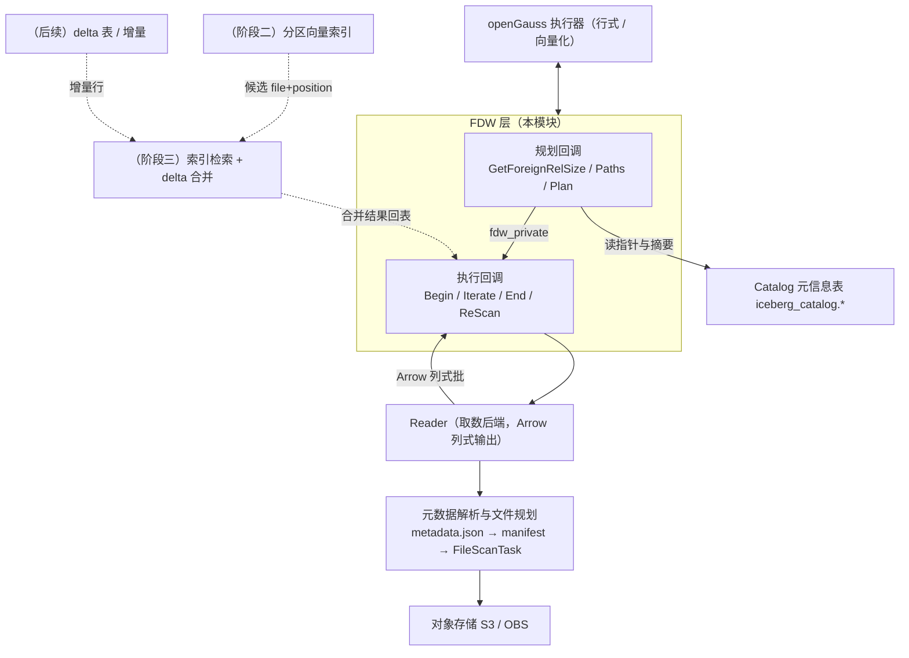

# openGauss Iceberg FDW 概要设计与决策点（讨论待定版）

## 1. FDW 概述与设计背景

### 1.1 文档定位与读者

本文面向新接手本模块的成员，多数读者此前未参与本设计，亦不要求熟悉 PostgreSQL / openGauss 的 FDW（Foreign Data Wrapper，外部数据封装器）机制。文档先介绍 FDW 的功能意义、责任边界与内部结构，再据此说明本模块在新架构第一阶段的范围，以及其中需要进一步学习、与相关方确认或在评审中讨论的设计点。文档为讨论稿，不锁定具体实现。

### 1.2 功能意义

openGauss 用户希望以标准 SQL 查询存放在对象存储中的 Iceberg 表，而无需先把数据导入数据库。FDW 是 openGauss 提供的外部数据源接入框架：通过实现一组约定回调，把一个外部数据源映射为数据库中的一张"外表"（foreign table），使 `SELECT` 等语句能像访问本地表一样访问外部数据。

本模块是一个面向 Iceberg 的 FDW：把一张 Iceberg 表注册为 openGauss 外表，查询该外表时，FDW 负责定位表的当前版本、规划要读取的数据文件、读取并将列式数据转换为数据库元组返回执行器。对用户而言，Iceberg 外表与本地表在 SQL 层无差别。

### 1.3 责任边界

FDW 是接入适配层，处在数据库执行器与 Iceberg 数据之间。界定其负责与不负责的部分，有助于明确本模块工作量与对外依赖：

| 角色 | 负责 | 说明 |
| --- | --- | --- |
| FDW（本模块） | 规划集成、执行集成、类型转换、内存管理、规划→执行的私有数据传递 | 实现 FdwRoutine 回调，把 Iceberg 接入 openGauss 优化器与执行器 |
| Reader / SDK | Iceberg 格式解析、文件规划与剪枝、读数据文件、输出列式数据 | FDW 的取数后端，可由 SDK 或自研实现 |
| Catalog 元信息表 | 表身份、当前版本指针、结构摘要的持久化 | 上游，FDW 只读消费；大概率不由本方维护 |
| 执行器 | SQL 计算（连接、聚合、过滤、排序） | FDW 只返回元组，不做计算 |
| 对象存储 | 存放 metadata、manifest、data file | 由 Reader 访问 |

概括：FDW 不解析 Iceberg 格式、不持久化元数据、不做 SQL 计算、不直接读对象存储——这些分别由 Reader、Catalog、执行器与对象存储承担；FDW 负责把它们接起来。

### 1.4 内部结构：规划期与执行期回调

FDW 经一组回调与数据库交互，分规划期与执行期两条路径。二者不共享内存，经计划节点上的私有数据（`fdw_private`）传递信息。

规划期（每条查询规划一次，可随计划缓存摊薄）：

| 回调 | 职责 |
| --- | --- |
| `GetForeignRelSize` | 估计外表返回行数，供优化器比较代价 |
| `GetForeignPaths` | 登记外表的访问路径（如全表扫描） |
| `GetForeignPlan` | 将选中路径固化为计划节点：解析表身份、拆分谓词、编码 `fdw_private` |

执行期（驱动实际取数）：

| 回调 | 职责 |
| --- | --- |
| `BeginForeignScan` | 建立扫描状态与内存上下文，打开 Reader |
| `IterateForeignScan` | 取数热路径，逐行（或逐批）返回元组，数据耗尽返回空 |
| `EndForeignScan` | 释放 Reader 与内存 |
| `ReScanForeignScan` | 重置游标重新扫描（相关子查询、嵌套循环内表会触发） |

### 1.5 总体架构与数据流

架构沿用 FDW 的经典分层（规划 / 执行回调 + 取数后端 + 上游 Catalog + 下游对象存储），并为后续阶段预留扩展位：阶段二、三将引入 Iceberg 分区向量索引检索，以及与可能的 delta 表合并的读取路径。下图实线为第一阶段路径，虚线为后续阶段扩展位。

第一阶段数据流：

1. 规划期 `GetForeignRelSize` 读 Catalog 取当前 snapshot 摘要估行；`GetForeignPlan` 读 Catalog 取 `metadata_location` 与当前指针，拆分可下推 / 不可下推谓词，将扫描入口与投影列编码进 `fdw_private`。规划期不访问对象存储。
2. 执行期 `BeginForeignScan` 解码 `fdw_private`，打开 Reader；Reader 据 `metadata_location` 解析元数据、规划数据文件、读取并输出 Arrow 列式批。
3. `IterateForeignScan` 将 Arrow 批转为元组逐行返回；不可下推的谓词由执行器在节点上重过滤。

后续阶段扩展（虚线）：带索引查询时，规划期追加一条索引扫描路径；执行期由分区向量索引返回候选行位置，与可能的 delta 表增量行合并后回表取整行。第一阶段在路径生成、私有数据编码、回表寻址三处预留接口形态，使该扩展无须重构（见第 7 章）。

### 1.6 阶段划分与第一阶段范围

| 阶段 | 内容 | 本文范围 |
| --- | --- | --- |
| 一 | Iceberg FDW 完整读取路径（元数据 → 文件规划 → 读取 → 回表） | 是 |
| 二 | 为 Iceberg（有分区）实现分区向量索引 | 否（约束来源） |
| 三 | 带索引的 ForeignScan 通路、与 delta 表合并 | 否（约束来源） |

第一阶段首期实现只读 Foreign Scan，二级命名 `namespace.table`，支持列裁剪、基础谓词下推与分区剪枝，覆盖标量与常用类型，存储面向 S3 / OBS；写入、多级嵌套 namespace、复杂谓词与聚合下推、完整嵌套类型不在首期范围。阶段二、三虽不在本文实现范围内，但其需求（分区组织、向量检索、按位置回表、delta 合并）构成第一阶段若干设计点的约束，文中在相关处标注其影响。

后续各设计点统一从三个维度权衡：性能（以对象存储 I/O 与行列、跨语言转换为主）、与 openGauss 向量化引擎的适配度、对阶段二三的可扩展性。

---

## 2. Catalog 元信息层（既定前提）

当前 Catalog 元信息表为既定前提，大概率不由本方维护，本模块按现状只读对接。本章介绍其结构与 FDW 的消费方式，并指出一个影响 FDW 性能、需与元数据负责方协商的点。这里不展开元信息表自身的设计取舍。

### 2.1 现状结构与 FDW 消费

当前设计将 `metadata.json` 顶层摘要拍平为四张表：`tables`（表身份与当前指针）、`table_schemas`（字段级 schema）、`snapshots`（snapshot 摘要）、`partition_specs`（分区规则），另有一张异步清理任务表；不缓存 manifest 与 data file 明细，`metadata.json` 为唯一权威。

FDW 从中读取的主要是 `tables` 的 `metadata_location` 与当前 snapshot / schema 指针；估行需要当前 snapshot 的记录数。这些均为普通列，规划期一次查询即得，不访问对象存储。Catalog 为库内普通表，FDW 经 SPI 或 systable 点查读取，属低频操作。

以下几项已按现状采用（非本模块决策，列出以对齐认知）：

- schema 顶层字段拍平存储，嵌套类型保留权威 JSON 或由 Reader 重解析；FDW 不依赖该表做列解析。
- 表基数取自当前 snapshot 记录数；其具体来源（在 `snapshots` 增列写入，或回退读 `metadata.json`）待与元数据负责方确认。
- namespace 采用二级命名；外表与本地 relation 的绑定（`tables.relid`）按注册侧能力决定。

### 2.2 待协商点：文件清单缓存

FDW 的主要对象存储开销来自 manifest 展开（把 snapshot 解析为数据文件清单），该开销在每次执行、每次 ReScan 重复发生（见 5.1）。一种缓解是由 Catalog 侧按 snapshot 缓存文件清单（形如 `data_files(table_uuid, snapshot_id, file_path, ...)`），把 manifest 展开降低到每个 snapshot 首次访问。

其安全性来自 snapshot 文件集不可变：提交新 snapshot 时指针前移，FDW 自然读新 snapshot（首次未命中、之后命中），旧行按容量裁剪，无写时失效逻辑。

是否引入该缓存属元信息表设计范畴，需与负责方协商。对 FDW 而言，它直接决定重复扫描与索引回表的对象存储代价，是值得提出的优化项。

---

## 3. 规划与下推

本章为规划期三个回调的设计点。

### 3.1 估行与代价

基数来源见 2.1；选择率有三种来源：固定值、`clauselist_selectivity`（依赖列统计）、基于 Iceberg 列统计（manifest 的 lower / upper bound）。估行影响连接顺序与路径选择。首期可用固定选择率，后续接入 Iceberg 列统计提升精度。带向量 topk 的查询代价模型另行设计（见 7.5）。

### 3.2 路径生成

`GetForeignPaths` 首期仅需登记一条全表扫描路径。但为阶段三的带索引扫描预留，建议将路径生成写成可追加多路径的形态：后续以追加一条 ForeignPath 或 CustomPath 的方式接入索引扫描路径，由优化器按代价择优，而非重构规划层。该扩展位的完整描述见第 7 章。

### 3.3 私有数据编码

`fdw_private` 在规划期编码、执行期解码。其内容取决于文件规划时机（见 4.1）：仅编码扫描入口指针（`metadata_location` + snapshot / schema id），或编码完整文件列表。此外应为阶段三预留索引扫描私有数据（候选过滤、topk 参数）的编码位。

### 3.4 谓词、分区与列下推

下推分三层：

| 层 | 位置 | 依据 | 适用列 |
| --- | --- | --- | --- |
| 分区摘要 | 规划期或执行期 | manifest list 的分区 lower / upper bound | 分区列 |
| 列统计 | 执行期 | manifest 的列 min / max | 任意列 |
| 行组统计 | Reader 读取时 | Parquet footer 行组统计 | 由 Arrow reader 内部处理 |

谓词表达能力首期覆盖 AND 合取的标量比较、`IN`、`IS [NOT] NULL`，其余复杂谓词留作节点 qual 由执行器重过滤。列裁剪（投影下推）应实现以减少 Parquet I/O。向量 topk 下推属阶段三，其编码位在 3.3 预留。

---

## 4. 元数据解析与数据读取

本章为取数后端（Reader）相关的设计点：元数据如何解析、由谁实现、以何种格式交付。

### 4.1 元数据解析归属与文件规划时机

"把 snapshot 解析为待读数据文件清单"这一步由谁、在何时完成，是两个相关联的选择。

| 维度 | 候选 | 取舍 |
| --- | --- | --- |
| 解析归属 | SDK 内部（喂 `metadata_location`，SDK 规划文件） | 自带 schema evolution、剪枝、MOR 语义，降低实现成本；但黑盒，规划期难取文件级信息 |
| 解析归属 | 自行解析（喂 FileScanTask，自读 manifest） | 可控，规划期可做文件级代价与并行切分；但需自实现 Iceberg 元数据解析 |
| 产出时机 | 规划期产出（编入 `fdw_private`） | 配合计划缓存省重复展开；但存在 snapshot 漂移 |
| 产出时机 | 执行期产出（Reader 内部规划） | 规划期零对象存储 I/O、snapshot 更新鲜；但每次 Begin、每次 ReScan 重复展开 manifest |

两者与 Reader 选型（4.2）绑定：选 SDK 路线则解析归 SDK、产出在执行期；自行解析仅在需要规划期文件级控制或并行切分时具备额外收益。执行期产出的重复展开开销可由文件清单缓存（2.2）吸收，叠加后两种时机代价趋同，当前倾向"执行期产出 + 文件清单缓存"。

### 4.2 Reader 选型

Reader 是数据读取后端，负责解析元数据、规划并读取数据文件、以 Arrow 列式批输出。候选路线如下：

| 路线 | 引擎 | 运行时 | 进 openGauss 方式 | MOR | 编译与集成 | 成熟度 |
| --- | --- | --- | --- | --- | --- | --- |
| Java | iceberg-java + iceberg-arrow | 内嵌 JVM | JNI + C 桥接 | 行式回退支持 | JDK 17、约 814MB 依赖包、GC | 有可运行原型 |
| Rust | iceberg-rust | 原生 cdylib | 自建 C FFI（cbindgen） | 原生 position + equality | Rust 工具链，无虚拟机 | 库成熟，官方 C FFI 起步 |
| C++ 官方 | iceberg-cpp | 原生 | 直接链接 | position + equality | 要求 C++23 / GCC 14+，与现有工具链冲突 | 0.2 版，写入能力规划中 |
| C++ 社区 | iceberg-cxx | 原生 | 直接链接 | position + equality + DV | C++20，强依赖固定版 libarrow | 生产使用，缺分区层剪枝 |
| DuckDB | duckdb-iceberg | 独立进程 | 进程间通信 | 完整 | 黑盒进程，运维较重 | 生产使用 |
| 自研 | 自解析 + Arrow C++ parquet | 原生 | 同进程 | 自实现 | C++17，工作量大 | 需自建 |

三维度权衡：性能上原生路线（Rust / C++ / 自研）免去虚拟机冷启动与 GC，独立进程的文本路径最慢；适配上各路线公约数为 Arrow 列式接口，FDW 转换层可复用，便于后续对接向量化输出；扩展性上 Rust 与自研对回表与索引扩展更友好。

当前倾向以 Rust 与自研 C 为两条主候选，经专题对比与小规模验证后确定；C++ 官方路线因 C++23 门槛列为高风险候选。本文不锁定，此项需重点学习与评估。

### 4.3 数据交换格式

建议以 Arrow C Data Interface 作为 Reader 与 FDW 层的统一边界：两个 C 结构体传递列式数据，零拷贝、免链接 Arrow 动态库、跨语言。该边界使 Reader 选型与 FDW 转换层解耦——更换读取引擎不改 FDW 代码，向量化输出路径亦复用同一列式入口。该项当前作为既定方向。

### 4.4 Delete File（MOR）

首期是否读取含 delete file 的表。Rust、C++ 各路线原生支持 position 与 equality delete；Java 向量化快路径不支持，需行式回退。若阶段二的索引建于含 delete 的表上，回表须正确应用 delete，故倾向首期纳入该能力，启用时机可后置。

---

## 5. 执行、回表与向量化输出

本章为执行期回调的设计点。

### 5.1 批调度与生命周期

Reader 一次返回一批，FDW 按"批耗尽再取"驱动并逐行（或逐批）吐出。`BeginForeignScan` 建立扫描态与内存上下文并打开 Reader，`IterateForeignScan` 取批转换，`EndForeignScan` 释放。变长列与 decimal 须在批回收前拷入 PG 内存。

ReScan 经关闭后重开实现：Reader 接口为打开 / 取批 / 关闭，无原地重绕。相关子查询与嵌套循环内表会多次 ReScan，导致 Reader 重开（执行期产出文件规划时含 manifest 展开），使对象存储读随 ReScan 次数放大——这是单查询内读放大的主因，可由文件清单缓存（2.2）吸收。

### 5.2 行式与向量化输出

| 候选 | 路径 | 装配 | 执行器适配 |
| --- | --- | --- | --- |
| 行式 | Arrow → HeapTuple，`IterateForeignScan` 返回 `TupleTableSlot` | 逐行构造元组 | 向量化计划上需行转列再向量化 |
| 向量化 | Arrow → `VectorBatch`，`VecIterateForeignScan` | 逐列填充 `ScalarVector` | 直接进入向量化算子 |

openGauss 向量批 `VectorBatch` 按列持有 `ScalarVector`，批长默认 1000，值数组为 8 字节 `ScalarValue`（Datum），空值以逐行字节标记，变长类型经伴随缓冲存储。该布局与 Arrow 的紧凑 buffer 加位图不同，无法以内存拷贝直接转换，仍需逐值转换。

逐值转换成本两条路径相同；向量化路径省去逐行元组构造与行式结果的二次向量化，对大批量列式消费收益明显，但需按 openGauss 向量化类型系统填充 `ScalarVector`，集成面更大。

当前倾向首期行式以稳定契约，向量化作为高优先增强。阶段三的向量检索结果天然适合向量化消费，该适配度直接影响整体性能，建议尽早原型验证 Arrow 到 VectorBatch 的转换。

### 5.3 回表寻址

全表扫描下回表即 Arrow 到元组的物化。阶段三的索引扫描中，向量索引返回候选行的 `(file_path, position)`，需据此回表读取整行；外表无本地 heap 与 ctid，回表寻址须由 FDW 与 Reader 自定义。决策在于首期 Reader 是否预留按 `(file, position)` 定位读取的入口（而非仅顺序全扫）。这是阶段三高效回表与 delta 合并的前置，依赖文件清单缓存与 Reader 的位置寻址能力，建议首期即预留该入口。

---

## 6. 类型映射与运行时

### 6.1 类型映射

Iceberg 经 Arrow 映射到 openGauss 类型。需注意 timestamp 与 date 的纪元偏移、decimal128 到 Numeric 的转换、嵌套 list / struct / map 到数组或 JSONB 的映射。decimal 与嵌套类型须明确首期支持范围。

### 6.2 向量类型映射

openGauss `access/datavec` 提供 `vector`、`halfvec`、`sparsevec`、`bitvec` 类型。Iceberg 中向量通常以 `list<float>` 或定长类型存储。将读出的向量列映射为 openGauss `vector` 类型，是阶段二、三的数据基础。建议首期即打通 `list<float>` 到 `vector` 的最小通路。

### 6.3 运行时与并行

内存上下文每批回收变长列拷贝，临时上下文用于单行分配；变长与 decimal 必须拷入 PG 内存，Arrow buffer 释放后失效。运行时形态（虚拟机、原生运行时或独立进程）随 Reader 选型而定，原生路线最轻。并行扫描经 `create_foreignscan_path` 的 `dop` 接口，需将文件清单切分给多 worker；Iceberg 分区是天然并行切分单位，可与索引分区对齐。

---

## 7. 面向向量索引与 delta 合并的扩展位

本章不属第一阶段实现内容，而是第一阶段设计须为之预留的接口形态清单。逐项标注其依赖的第一阶段设计点。

### 7.1 带索引的 ForeignScan 路径

openGauss 向量检索经索引访问方法实现（`access/datavec` 提供 IVFFlat、HNSW、DiskANN 三种）。外表无本地索引访问方法，带索引扫描须由 FDW 以追加 ForeignPath 或 CustomScan 的形式表达，参考 openGauss 向量检索的扫描路径。依赖 3.2 的多路径预留。

### 7.2 索引、分区与元数据协同

阶段二的索引按 Iceberg 分区组织。FDW 需能按分区裁剪、对选中分区的索引执行近似最近邻检索、合并 topk 结果。依赖 3.4 的分区剪枝与索引的协同。

### 7.3 回表接口

索引返回候选行的 `(file_path, position)`，FDW 与 Reader 据此回表读取整行。依赖 5.3 的位置寻址与 2.2 的文件清单定位。

### 7.4 delta 表合并

向量索引覆盖某一时点的已建索引数据；该时点之后的增量可能落在尚未纳入索引的 delta 数据中。带索引查询时，FDW 需将索引检索结果与 delta 数据的扫描结果合并后返回，避免漏读新数据。这要求扫描路径能在同一查询内组织"索引检索 + delta 扫描"两个来源并归并。delta 的具体形态（较新的 Iceberg snapshot、单独的增量表或缓冲）待阶段二、三明确；第一阶段需保证读取路径不假设单一数据来源，依赖 3.2 的路径生成与 5.3 的回表寻址。

### 7.5 向量 topk 下推

`ORDER BY embedding <-> query LIMIT k` 形式的检索下推到 FDW 与索引，依赖 3.3 的私有数据编码与 3.2 的路径预留。

第一阶段的路径生成（3.2）、私有数据编码（3.3）、回表寻址（5.3）、文件清单底座（2.2）四处的形态，决定阶段三能否平滑接入而无须重构。

---

## 8. 需要学习、询问与质疑的点

下表汇总本文设计点，按面向新成员的处理方式归类：学习（需补充背景）、询问（需与相关方确认）、质疑（评审中可挑战的取舍）。

| 主题 | 类型 | 要点 | 对象 |
| --- | --- | --- | --- |
| FDW 回调机制与执行模型 | 学习 | 规划 / 执行两期回调、`fdw_private` 传递、行式迭代模型 | 本组 |
| openGauss 向量化与 `VectorBatch` | 学习 | 向量批结构、与 Arrow 布局差异（5.2） | 本组 |
| openGauss 向量栈 `access/datavec` | 学习 | vector 类型与三种 ANN 索引，供阶段三参考 | 本组 |
| 表基数来源 | 询问 | 在 `snapshots` 增列还是回退读 metadata（2.1、3.1） | 元数据负责方 |
| 文件清单缓存 | 询问 | 是否按 snapshot 缓存文件清单（2.2） | 元数据负责方 |
| 回表接口与 delta 形态 | 询问 | 候选行格式、按位置取行、delta 来源（5.3、7.3、7.4） | 阶段二 / 三成员 |
| Reader 选型 | 质疑 | Rust 与自研 C 之选，C++23 门槛（4.2） | 全组 |
| 行式 vs 向量化输出 | 质疑 | 首期行式、向量化增强的取舍（5.2） | 全组 |
| 解析归属与文件规划时机 | 质疑 | SDK 解析 + 执行期产出 + 缓存（4.1） | 全组 |
| 数据交换格式 | 质疑 | 以 Arrow C Data Interface 为统一边界（4.3） | 全组 |

第一阶段最小闭环：按现状对接 Catalog（SPI 读）+ SDK 解析 + 执行期产出文件规划 + 选定一条 Reader + Arrow 交换 + 行式输出 + 基础下推 + 标量类型映射，跑通"元数据 → 读取 → 回表"。其余项（文件清单缓存、向量化输出、回表寻址、向量类型映射、多路径与 delta 合并预留）作为为阶段二、三铺路的并行增强项推进。

---

## 附：候选 Reader 能力速查

| 能力 | iceberg-rust | iceberg-cpp | iceberg-cxx | Java + arrow | 自研 C |
| --- | :-: | :-: | :-: | :-: | :-: |
| 文件规划与剪枝 | 完整 | 完整 | 无分区层 | 完整 | 自实现 |
| Delete v2（pos + eq） | 支持 | 支持 | 支持 + DV | 行式回退 | 自实现 |
| Schema evolution | 支持 | 支持 | 支持 | 支持 | 自实现 |
| Arrow 输出 | RecordBatch → FFI | 原生 C Data | 需 libarrow | exportVector | ArrowArray |
| 编译门槛 | Rust | C++23 / GCC 14+ | C++20 + libarrow | JDK 17 | C++17 |
| 进 openGauss 方式 | cdylib + C FFI | 直接链接 | 直接链接 | JNI | 直接链接 |
